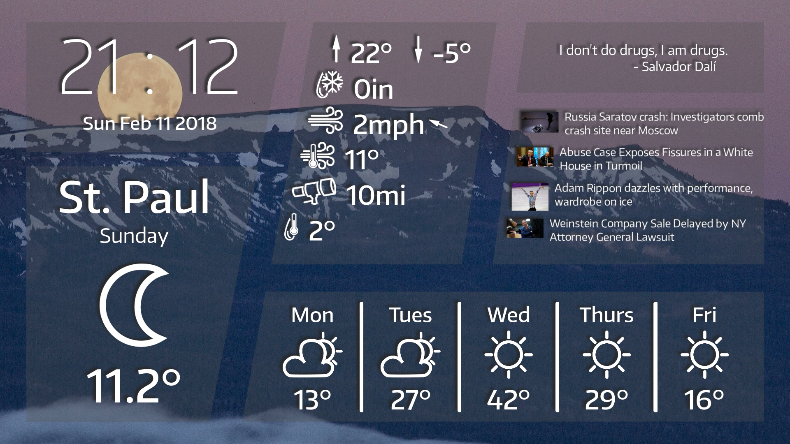

node-weather-station
====================

A simple weather and headline display/dashboard.
Uses [Weather Underground](https://www.wunderground.com) for weather, and [News API](https://newsapi.org/) for headlines.
In order to use it, you will need to obtain an API key for both of these services.



Prerequisites
-------------

You will need the following tools to build and use node-weather-station:
 * Typescript (building)
 * `sassc` (building)
 * `node`, `npm` (building and running)

Configuration
-------------

After cloning/downloading the repository, and verifying that you have the required tools, you will need to modify the config files.

First off, copy/move `src/config.example.ts` to `src/config.ts`, and fill out the following options:
 * `api_key`: Your API key from Weather Underground
 * `state`: The two-letter code for your state
 * `city`: Name of your city (spaces replaced with underscores)

Secondly, copy/move `src/web/config.example.ts` to `src/web/config.ts`, and fill out the following options:
 * `location_name`: Location string to be displayed in weather summary.
 * `api_key`: News API API key
 * `country`: News API country code
 * `category`: (optional) Desired categories
   * If desired, uncomment first `url` statement, and comment second one.
 * Create at least one backdrop theme in `backdropThemes` (example comming soon...)
   * See `BackdropEntry`

Building and Running
--------------------

Once you have modified the configs, simply run:
```
npm run build-all
```

Then, to run the server, run:
```
npm run serve
```

Then the app should be accessible from http://localhost:3000